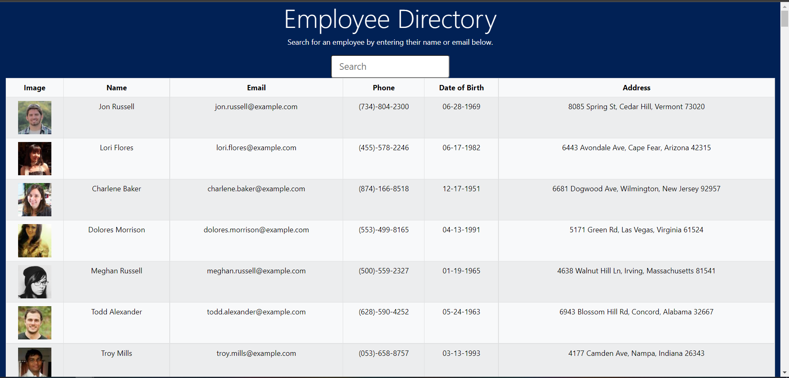
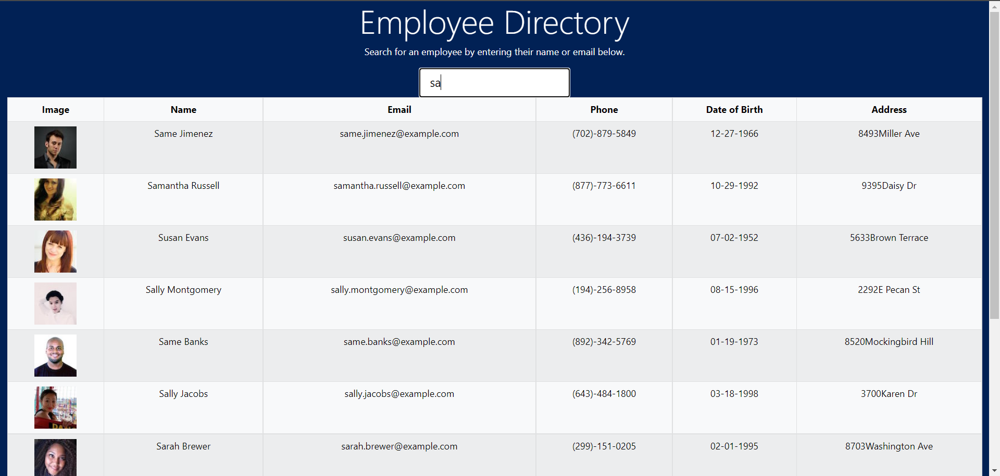

# Employee Directory

## Description
A React application that allows the user to view and sort through their entire directory of employees by employee name.

  ## Table of Contents
  
  * [Installation](#installation)
  
  * [Usage](#usage)
  
  * [License](#license)

  * [Tests](#tests)
  
  * [Questions](#questions)
  
  ## Installation
  
  To install necessary dependencies, run the following command: "npm i".

   ## Usage

To start the app in the CLI : "npm start"  

The screenshot below shows the directory filtered by typing in the letter "sa"

  ## License
    
    This application is licensed under the MIT license.
    

  ## Tests
  
  There are no tests for this application.
  
      
  ## Questions  

  If you have any questions about the repo or application, open an issue or contact me directly at sample. More of my work can be found at [My Github](https://github.com/brob92993).

  [Employee Directory Repository](https://github.com/brob92993/EmployeeDirectory.git)

  
  [Deployed application](https://brob92993.github.io/EmployeeDirectory/)